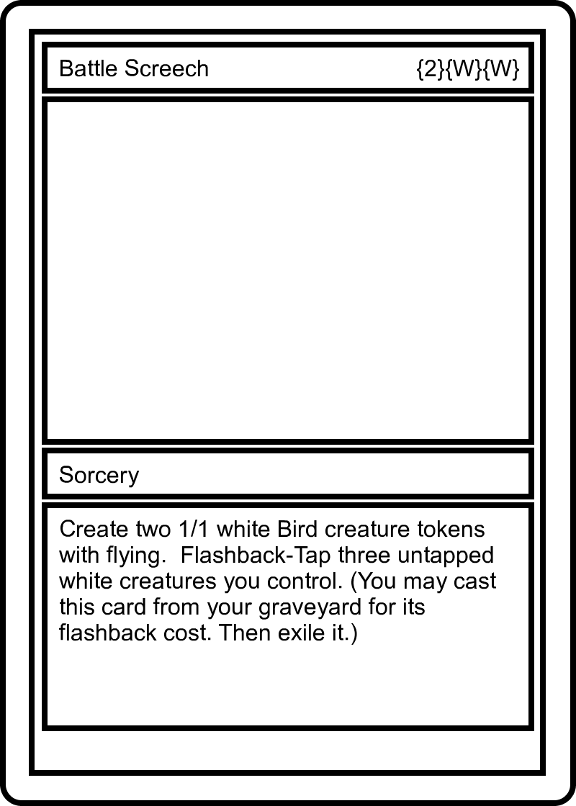

# mtg-proxy

Create MTG clean Proxie Cards using a MOL list as entry.

# Usage

Download the CLI

```sh
$ npm i -g mtg-proxy
```

Create a file with a cards list, with the following format:

```txt
4 Battle Screech
1 Veteran Armorer
```

Now you can create your proxies just running:

```sh
$ mtg-proxy create --from="my-card-list.txt"
```

Now you has your output:

<p align="center">

&nbsp &nbsp

</p>

# Options

- ### Creating the files inside a folder

  When you run the command it create the proxies inside your current folder. You can create inside another folder using th `--to` parameter:

  ```sh
  $ mtg-proxy create --from="my-card-list.txt" --to="./my-proxies-folder"
  ```

# Roadmap

- [x] Create cards from MOL list
- [ ] Fix proxies sizes to fit in sleeves/shields
- [ ] Create cards from MTGA list
- [ ] Create a PDF with the right size to use as proxie and all cards by list quantity

# License

MIT
